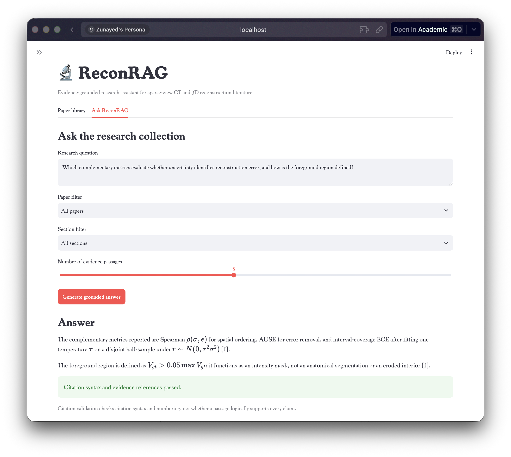
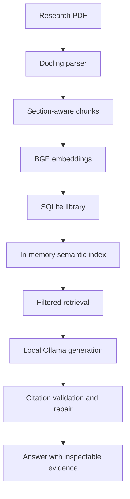

# ReconRAG

ReconRAG is a local, evidence-grounded research assistant for sparse-view CT,
limited-angle reconstruction, Gaussian representations, and related 3D
medical-imaging literature.

It parses research PDFs, creates section-aware chunks, retrieves relevant
passages using dense semantic search, and generates locally grounded answers
with numbered evidence citations.

> [!IMPORTANT]
> ReconRAG is a research and educational tool. It does not provide medical
> advice, diagnosis, or clinical decision support.



## Highlights

- Local PDF ingestion with structured parsing through Docling
- Section-aware, overlapping text chunks with page provenance
- Dense semantic retrieval using `BAAI/bge-small-en-v1.5`
- Optional document and section filters
- Local answer generation through Ollama
- Deterministic citation syntax and numbering validation
- One bounded repair attempt for missing or invalid citations
- Persistent papers, chunks, and embeddings in SQLite
- Duplicate-paper detection using file checksums
- Dense, BM25, and hybrid RRF retrieval evaluation
- Streamlit interface for ingestion, inspection, retrieval, and generation
- Automated Ruff and pytest checks with GitHub Actions

## Architecture



The SQLite library stores document metadata, parsed content, chunks, and
embedding vectors. At startup, ReconRAG restores the semantic index from this
local database. If the configured embedding model changes, stale documents
are automatically re-embedded.

## Retrieval evaluation

ReconRAG includes a manually labelled retrieval benchmark covering eight
questions from a sparse-view CT uncertainty paper.

| Retriever | Recall@5 | MRR | Hit rate |
|---|---:|---:|---:|
| Dense semantic | **0.896** | 0.938 | **1.000** |
| BM25 lexical | 0.740 | 0.750 | 0.875 |
| Hybrid RRF | 0.781 | **1.000** | **1.000** |

Dense semantic retrieval remains the application default because it recovered
the most complete set of labelled evidence. The benchmark, frozen reports,
methodology, and limitations are documented in
[`benchmarks/README.md`](benchmarks/README.md).

## Requirements

- Python 3.13 or later
- [`uv`](https://docs.astral.sh/uv/)
- [`Ollama`](https://ollama.com/)
- Sufficient local memory for the embedding and generation models

The default local models are:

- Embeddings: `BAAI/bge-small-en-v1.5`
- Generation: `gemma4:e2b`

## Installation

Clone the repository and install the locked dependencies:

```bash
git clone https://github.com/zunaaaaayed/ReconRAG.git
cd ReconRAG
uv sync --locked
```

Install the default generation model:

```bash
ollama pull gemma4:e2b
```

Ensure Ollama is running, then start ReconRAG:

```bash
uv run streamlit run app.py
```

The embedding model is downloaded automatically on first use.

## Usage

1. Open the **Paper library** tab.
2. Upload one or more research PDFs.
3. Select **Parse, chunk, and index papers**.
4. Inspect the extracted blocks, section-aware chunks, and Markdown.
5. Open **Ask ReconRAG**.
6. Optionally filter retrieval by paper or section.
7. Ask a research question and select the number of evidence passages.
8. Inspect the answer, citation status, and retrieved evidence cards.

Uploaded PDFs are copied to `papers/`. Parsed content, chunks, and embeddings
are stored in `data/reconrag.db`.

Removing a paper from the library deletes its parsed content, chunks, and
embeddings from SQLite. The original PDF remains in `papers/`.

## Citation integrity

Generated answers use numbered citations such as `[1]` and `[1, 3]`, aligned
with the evidence cards displayed below the answer.

ReconRAG validates:

- whether an answer contains citations;
- whether citation syntax is supported;
- whether cited evidence numbers exist;
- how many retrieved evidence passages were cited.

When the first answer contains missing, malformed, or out-of-range citations,
ReconRAG makes at most one focused repair request.

Citation validation checks syntax and evidence numbering. It does not prove
that every cited passage logically entails every generated claim.

## Configuration

Runtime settings use the `RECONRAG_` environment-variable prefix. Copy the
example file to customize the defaults:

```bash
cp .env.example .env
```

| Variable | Default | Purpose |
|---|---|---|
| `RECONRAG_APP_NAME` | `ReconRAG` | Application title |
| `RECONRAG_PAPERS_DIR` | `papers` | Local PDF directory |
| `RECONRAG_DATABASE_PATH` | `data/reconrag.db` | SQLite library path |
| `RECONRAG_EMBEDDING_MODEL` | `BAAI/bge-small-en-v1.5` | Embedding model |
| `RECONRAG_RETRIEVAL_TOP_K` | `5` | Default evidence count |
| `RECONRAG_GENERATION_MODEL` | `gemma4:e2b` | Ollama model |
| `RECONRAG_OLLAMA_HOST` | `http://localhost:11434` | Ollama endpoint |
| `RECONRAG_GENERATION_MAX_TOKENS` | `500` | Generation limit |
| `RECONRAG_CHUNK_TARGET_TOKENS` | `350` | Target chunk size |
| `RECONRAG_CHUNK_OVERLAP_TOKENS` | `50` | Adjacent chunk overlap |

Changing the embedding model causes stored papers to be re-indexed when the
application next loads the library.

## Evaluation CLI

List stored chunks for benchmark labelling:

```bash
uv run python -m reconrag.evaluation.cli chunks
```

Export the catalogue:

```bash
uv run python -m reconrag.evaluation.cli chunks \
  --output benchmarks/chunks.json
```

Evaluate a retriever:

```bash
uv run python -m reconrag.evaluation.cli run \
  benchmarks/closed_uncertainty.json \
  --retriever semantic \
  --output benchmarks/results/closed_uncertainty-semantic.json
```

Supported retrievers are `semantic`, `lexical`, and `hybrid`.

## Development

Run the complete quality suite:

```bash
uv run ruff format --check .
uv run ruff check .
uv run pytest
git diff --check
```

The current test suite contains 55 deterministic tests covering ingestion,
chunking, retrieval, persistence, evaluation, generation, and citation
validation. Ollama is replaced with test doubles during automated tests.

## Privacy and data handling

PDFs, parsed text, embeddings, the SQLite library, retrieval, and generation
remain on the local machine during normal operation.

Internet access may be required initially to download Python dependencies,
the embedding model, and the Ollama model. Research PDFs, databases,
environment files, and generated local indexes must not be committed.

Do not use patient-identifiable or otherwise sensitive data unless your
environment and data-handling process are authorized for it.

## Project structure

```text
.
├── app.py                         # Streamlit application
├── benchmarks/                    # Retrieval benchmark and reports
├── src/reconrag/
│   ├── evaluation/                # Benchmark loading and metrics
│   ├── generation/                # Prompts, generation, and citations
│   ├── ingestion/                 # PDF parsing and chunking
│   ├── retrieval/                 # Dense, BM25, and hybrid indexes
│   ├── services/                  # PDF storage and ingestion services
│   ├── storage/                   # SQLite persistence
│   ├── config.py                  # Environment-backed settings
│   └── models.py                  # Domain models
└── tests/                         # Deterministic test suite
```

## Limitations

- The current benchmark contains eight questions from one paper.
- Citation validation checks form and numbering, not semantic entailment.
- Dense retrieval uses an in-memory index and targets small research
  collections rather than large-scale deployment.
- Local answer quality and latency depend on the selected Ollama model and
  available hardware.
- PDF extraction quality depends on document structure and Docling parsing.
- The system has not been validated for clinical use.

## Roadmap

- Expand evaluation to multiple papers and research topics
- Add claim-level citation-support evaluation
- Reassess hybrid retrieval on a larger benchmark
- Evaluate reranking and query expansion
- Add answer-faithfulness and generation-quality benchmarks
- Improve table, equation, and figure-aware retrieval

## Third-party assets

ReconRAG uses the
[Cooper*](https://www.fontsquirrel.com/fonts/cooper) typeface. The bundled
font files remain licensed under the SIL Open Font License 1.1; see
[`static/fonts/OFL.txt`](static/fonts/OFL.txt).

The SIL OFL applies only to the bundled font files. ReconRAG's source code
remains licensed under the MIT License.

## License

ReconRAG is released under the [MIT License](LICENSE).